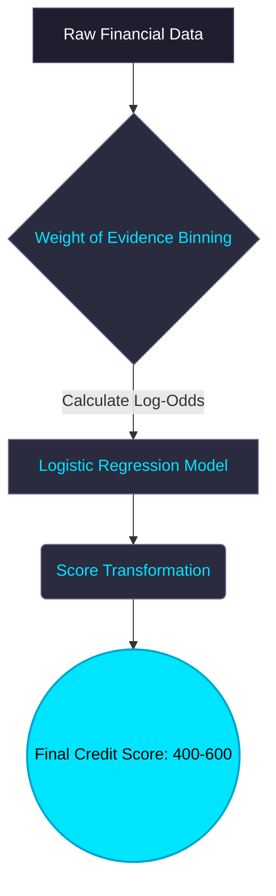
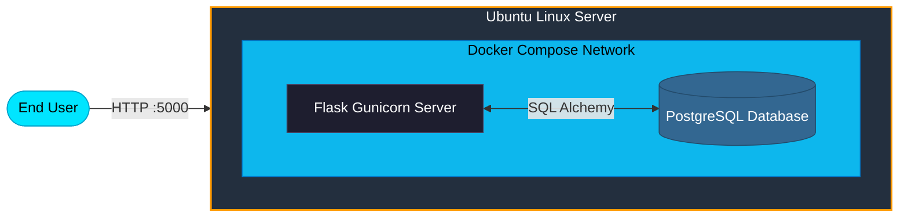

<div align="center">
  
  
  <br/>
  
  # 🏦 📡 Customer Risk Intelligence
  **Enterprise-Grade Machine Learning Pipeline & Scorecard Dashboard**

  [](https://tinyurl.com/w7mfe2cw)
  [](https://tinyurl.com/w7mfe2cw)
  [](https://tinyurl.com/w7mfe2cw)
  [](https://tinyurl.com/w7mfe2cw)

  *A full-stack, end-to-end AI system that translates raw financial data into highly interpretable credit decisions using Weight of Evidence (WOE) modeling, Explainable AI (XAI), and real-time cloud database auditing.*

</div>

<br />

> ### 🌐 **[Experience the Live Application Here!](https://tinyurl.com/w7mfe2cw)**

---

## ✨ Key Features

- 🧠 **Traditional Banking Scorecard Model:** Utilizes a highly interpretable Logistic Regression model trained on **Weight of Evidence (WOE)** transformed variables.
- 🎯 **Optimized for Business Logic:** Decision boundaries are mathematically tuned for maximum **F2 Score** to prioritize High Recall (catching potential defaults).
- 🔍 **Explainable AI (XAI):** The dashboard visually decomposes every prediction, showing the exact contribution of each feature so loan officers know *why* a decision was made.
- 💅 **Premium UI/UX:** A stunning, responsive "Midnight Tech" dark-mode interface with SVG gauges and smooth micro-animations.
- 🔌 **REST API Microservice:** Fully headless capabilities via the `/api/v1/predict` endpoint for programmatic integration.
- 📜 **PostgreSQL Audit Logging:** Every single application processed is silently and securely logged to a relational database with timestamps and system decisions for compliance.
- 🐳 **Dockerized Cloud Deployment:** Orchestrated via `docker-compose` and hosted live on an AWS EC2 instance.

---

## 🛠️ Technology Stack

| Category | Technologies |
| :--- | :--- |
| **Data Science & ML** | `Scikit-Learn`, `Pandas`, `NumPy`, `Joblib` |
| **Backend Framework** | `Flask`, `Gunicorn` |
| **Database & ORM** | `PostgreSQL`, `Flask-SQLAlchemy`, `psycopg2` |
| **Frontend** | `HTML5`, `Vanilla CSS3` (Midnight Tech Theme), `Jinja2` |
| **DevOps & Cloud** | `Docker`, `Docker Compose`, `AWS EC2`, `DVC` (Data Version Control) |

---

## 🚦 How the Scorecard Works



1. **WOE Binning:** Continuous and categorical variables are bucketed into discrete bins. Each bin is assigned a WOE value reflecting the log-odds ratio of good vs. bad customers.
2. **Linear Predictor:** A Logistic Regression model assigns strict coefficients to each WOE variable.
3. **Score Transformation:** Log-odds predictions are mapped to a human-readable scale. 
   - **Baseline:** A score of 600 represents baseline odds of 50:1.
   - **PDO (Points to Double Odds):** 20 points.
4. **Decision:** 
   - `< 500`: **REJECT** (High Risk)
   - `500 - 539`: **MANUAL REVIEW** (Moderate Risk)
   - `≥ 540`: **APPROVE** (Low Risk)

---

## 🔌 API Reference

You can completely bypass the visual dashboard and hit the machine learning model programmatically.

**Endpoint:** `POST /api/v1/predict`

```bash
curl -X POST https://tinyurl.com/w7mfe2cw/api/v1/predict \
     -H "Content-Type: application/json" \
     -d '{
           "age": 45,
           "credit_amount": 2000,
           "duration": 12,
           "purpose": "A43"
         }'
```

**JSON Response:**
```json
{
  "credit_score": 574,
  "decision": "APPROVE",
  "probability_of_default": 0.047,
  "risk_grade": "Very Low Risk",
  "status": "success",
  "db_status": "success"
}
```

---

## 💻 Local Development Setup

If you want to run this project locally on your machine:

**1. Clone the repository:**
```bash
git clone https://github.com/YOUR_USERNAME/Customer_Risk.git
cd Customer_Risk
```

**2. Spin up the infrastructure via Docker:**
*(Ensure Docker Desktop is running)*
```bash
docker-compose up --build -d
```
This single command will build the Python environment, download dependencies, start the PostgreSQL database container, and launch the Gunicorn Flask server!

**3. Access the Application:**
- Web Dashboard: `http://localhost:5000`
- API Endpoint: `http://localhost:5000/api/v1/predict`

---

## ☁️ Cloud Architecture (AWS)



This application is deployed on a highly scalable cloud architecture:
*   **Host:** AWS EC2 (`t2.micro` running Ubuntu 22.04 LTS)
*   **Networking:** Attached to a permanent AWS **Elastic IP**.
*   **Security:** AWS Security Groups configured to strictly allow inbound SSH (Port 22), Web Traffic (Port 5000), and Database Auditing (Port 5432).
*   **Containerization:** `docker-compose` bridges a virtual network between the Gunicorn Web Server and the PostgreSQL persistence volume.

---
<div align="center">
  <i>Built with passion at the intersection of Data Science and Full-Stack Engineering.</i>
</div>
